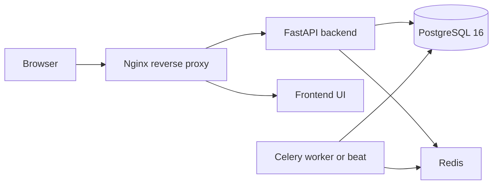

# Presentation notes — aras-fullstack-template

Use this as a talk track when presenting the template to an audience that doesn’t know the stack.

## 1) One-liner 
This template gives you a full web app “factory”: **frontend UI + backend API + database + background jobs**, all started with **one command** via Docker.

## 2) Mental model
Think of the app as a small team where each member has one job:
- **Frontend**: the website people click
- **Backend**: the “brains” / API that validates and processes requests
- **Database**: the long-term memory
- **Redis**: short-term memory + the waiting line for background work
- **Celery**: background workers that do long tasks without blocking the user
- **Nginx**: the receptionist / traffic director (single entrypoint)
- **Docker Compose**: the manager that starts everyone together and connects them

## 2.1) Tiny glossary 

### Docker terms
- **Image**: a “recipe + packaged app” (like a frozen meal).
- **Container**: a running instance of an image (the meal you heated up).
- **Service** (in Compose): a named container role like `db`, `backend`, `frontend`.

### Networking / ports
- **Port**: a numbered “door” on your machine.
  - Example: `http://localhost:8080` means: “talk to my computer via door 8080”.
- In Compose you’ll see `ports: "HOST:CONTAINER"`.
  - Example: `"8000:8000"` means: you can reach the container’s port 8000 through your laptop port 8000.

### Volumes (data + code)
- **Bind mount** (example: `./backend:/app`): shares your local code into the container so code edits appear instantly.
- **Named volume** (example: `pgdata:`): persistent storage managed by Docker.
  - Why: your database data shouldn’t vanish every time you restart containers.

### Environment variables (.env)
- A `.env` file is just “settings in text form” (passwords, URLs, feature flags).
- Containers read these settings at startup so code stays the same across dev/staging/prod.

## 2.2) The only URLs you need to remember (dev)
- `http://localhost:8080` — what you open in the browser (via Nginx)
- `http://localhost:8000/docs` — backend API docs (Swagger UI)
- `http://localhost:3000` — frontend dev server directly (usually you don’t need this)

## 3) What starts when you run Docker Compose (1 minute)
Dev command:
- `docker compose up`

This starts these containers (services) defined in `docker-compose.yml`:
- `db` — TimescaleDB image (PostgreSQL 16 + Timescale extension available)
- `redis` — Redis 7
- `backend` — FastAPI running on port 8000
- `frontend` — Vite dev server running on port 3000
- `nginx` — reverse proxy on port 8080 (the URL you actually open)

Optional (off by default):
- `celery-worker` and `celery-beat` — only start when you enable the `celery` profile

### What Docker Compose is doing (step-by-step)
When you run `docker compose up`, Compose:
1. **Builds images** for services that have a Dockerfile (`backend`, `frontend`) if needed.
2. **Starts containers** for each service.
3. **Creates a private network** so services can talk by name.
  - Example: the backend connects to Postgres at host `db` (not `localhost`).
4. **Waits for healthchecks** before starting dependent services.
  - `db` runs `pg_isready` to confirm Postgres is accepting connections.
  - `redis` runs `redis-cli ping`.
5. **Starts the backend**; the backend startup script runs DB migrations automatically (Alembic).
6. **Starts the frontend** (Vite dev server, hot reload).
7. **Starts Nginx** as the single entrypoint.

## 4) The request flow (what happens when a user opens the app)
From a browser, the user typically goes to:
- `http://localhost:8080`

Nginx then routes traffic:
- `/api/*` → backend (FastAPI)
- `/ws/*` → backend (WebSockets)
- everything else → frontend (React app)

So the browser talks to **one** address, and Nginx forwards internally.

If you want one sentence juniors remember:
- “Browser hits Nginx → Nginx sends API calls to FastAPI → FastAPI reads/writes Postgres (and sometimes Redis).”

## 5) Explain each piece (simple definitions)

### Docker & Docker Compose
- **Docker** packages an app + its dependencies into a consistent “box” (a container).
- **Docker Compose** describes multiple boxes (db, backend, frontend, etc.) and how they connect.

Why it matters: new developers can run the whole stack without manually installing Postgres, Redis, etc.

### FastAPI (Backend)
- A Python web framework that makes **API endpoints** like `/api/health`.
- This template uses async + Pydantic for validation.

How to phrase “API” to juniors:
- The frontend is the “face”. The backend is the “cashier + rule checker”. The API is the menu of things the frontend can ask the backend to do.

### PostgreSQL + TimescaleDB (Database)
- **PostgreSQL** is the main relational database (tables, rows, SQL).
- **TimescaleDB** is a PostgreSQL extension optimized for time-series data (events, metrics, logs).

Important nuance (good to say out loud):
- This template runs a TimescaleDB-capable Postgres image, but Timescale features are **only enabled when you explicitly run** `CREATE EXTENSION timescaledb;`.
- If you never enable it, it behaves like standard Postgres.

Why we ship Timescale in the template:
- Many real projects eventually store “events over time” (user activity, sensor data, audit logs). Timescale makes that scale better, and it’s optional.

### Alembic (Database migrations)
- **Alembic** is “version control for your database schema”.
- When your Python models change, Alembic can generate a migration file describing the change (create table, add column, etc.).

Why it matters:
- Every environment (your laptop, staging, production) can safely reach the same schema state.

Template behavior to mention:
- The backend container runs `alembic upgrade head` automatically on startup (see `backend/entrypoint.sh`).

Beginner example (what a migration *is*):
- Day 1: you have a `users` table with columns `id, email`.
- Day 10: you add `full_name` to your `User` model.
- Migration = a small script that says “ALTER TABLE users ADD COLUMN full_name ...”, so every environment updates the same way.

Why there are 2 DB URLs in `.env`:
- `DATABASE_URL` uses `asyncpg` (fast async driver) for the running API.
- `DATABASE_URL_SYNC` uses `psycopg2` (sync driver) because Alembic migrations run in sync mode.

### SQLAlchemy (ORM)
- The backend uses SQLAlchemy to map Python classes (models) to database tables.
- Your app code works with Python objects; SQLAlchemy turns that into SQL.

How to say “ORM” simply:
- “ORM lets you treat database rows like Python objects instead of writing raw SQL everywhere.”

### Redis (Cache + Queue)
- Redis is an in-memory key/value store.
- In this template it’s used for:
  - **cache** (fast reads, short-lived data)
  - **Celery broker/result backend** (the task queue and storing task results)

How to explain cache vs database:
- Database = long-term, reliable storage.
- Cache = short-term speed boost (it’s okay if it resets; the database is still the source of truth).

### Celery (Background jobs)
- Celery is a job system: instead of making the user wait for a slow task, you put work into a queue.
- A worker processes it in the background.

Examples of tasks:
- sending emails
- generating reports
- syncing data with external systems

Celery Beat:
- a scheduler that triggers periodic tasks (e.g., run every hour)

How it’s turned on:
- `docker compose --profile celery up`

What the queue idea looks like in 1 sentence:
- The API quickly says “Got it!” then Celery does the heavy lifting in the background.

### Nginx (Reverse proxy)
- Nginx is the “front door” to the system.
- It keeps the browser-facing URL stable and routes requests to the right service.

Why not hit backend and frontend directly?
- You *can*, but Nginx makes it feel like one app (one URL), and it matches how production deployments usually work.

Dev vs prod (simple phrasing):
- In dev, it proxies to the Vite dev server (hot reload) and FastAPI.
- In prod, it proxies to a static frontend nginx and a gunicorn-served backend.

## 6) Dev vs Production story 

### Development
- Hot reload is enabled:
  - backend runs `uvicorn --reload`
  - frontend runs Vite HMR
- Code is bind-mounted into containers so edits are reflected immediately.
- Nginx listens on `8080` for the “single entrypoint”.

Beginner explanation of “hot reload”:
- You edit code, save, and the app refreshes automatically without rebuilding everything.

### Production
Run:
- `docker compose -f docker-compose.yml -f docker-compose.prod.yml up -d`

Changes:
- backend runs **gunicorn + uvicorn worker** (more robust, multi-worker)
- frontend is **pre-built** into static files and served by nginx (no Node runtime)
- no bind mounts (images are immutable)
- services restart automatically (`unless-stopped`)
- Nginx uses port `80`

Beginner explanation of “pre-built frontend”:
- In production we don’t run the dev server. We compile the React app into plain static files (HTML/CSS/JS) and serve them efficiently.

## 7) Architecture diagram 

## 8) Common confusion points (good for Q&A)

### “What is localhost?”
- `localhost` means “this computer”. From your browser, `localhost:8080` is your laptop.
- Inside containers, `localhost` means “that container itself”, not your laptop.
  - That’s why the backend connects to Postgres using host `db` (the Compose service name).

### “Why do we have so many ports?”
- In dev, we expose multiple ports for convenience:
  - `8080` (nginx entrypoint)
  - `8000` (backend direct)
  - `3000` (frontend dev server direct)
- In production, we generally expose only `80` (or `443`) and keep internals private.

### “Will my database data disappear?”
- Database data is stored in a **named volume** (`pgdata`). It persists across restarts.
- If you run `docker compose down -v`, you delete volumes and lose DB data.

### “Why does the backend run Alembic on startup?”
- So a fresh clone can start without extra steps.
- It’s safe in dev; in production you still want discipline (review migrations, backups, etc.).

### “What if I don’t need Celery?”
- You can ignore it. The API + UI + DB still work.
- Turn it on only when you have real background jobs.
